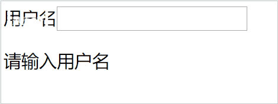

> 手把手教你模仿element ui中el-input组件，实现一个带有验证功能的input.


### element ui官方文档
```javascript 
<el-form :model="ruleForm" :rules="rules" ref="ruleForm" label-width="100px" class="demo-ruleForm">
	<el-form-item label="活动名称" prop="name">
		<el-input v-model="ruleForm.name"></el-input>
	</el-form-item>
</<el-form>


<script>
  export default {
    data() {
      return {
        ruleForm: {
          name: '',
        },
        rules: {
          name: [
            { required: true, message: '请输入活动名称', trigger: 'blur' },
            { min: 3, max: 5, message: '长度在 3 到 5 个字符', trigger: 'blur' }
          ],
        }
      };
    },
    methods: {
      submitForm(formName) {
        this.$refs[formName].validate((valid) => {
          if (valid) { // 验证通过  
          }
        });
      },
    }
  }
</script>

```

从官方文档中我们可以看到，这里一共有三个组件，分别是 el-form, el-form-item, el-input。


### 实现

#### 1. 在component中创建一个 Input.vue组件

代码如下
```
// app.vue

<template>
	<div id="app">
		<my-input type="text" :value="name"></my-input>
	</div>
</template>

<script>
	import MyInput from "./components/Input";
	export default {
		name: "app",
		components: {
			MyInput
		},
		data() {
			return {
				info:{
					name:"霍小叶"
				}
			}
		}
	};
</script>


// Input.vue

<template>
	<div id="inpt">
		<input :type="type" :value="value" />
	</div>
</template>

<script>
	export default {
		props: {
			label: {
				type: String,
				required: true,
			},
			prop: {
				type: String,
				required: true,
			}
		}
	}
</script>

```

- 我们在app.vue中引入了Input组件，并且绑定了一个value，那么当Input组件的值改变的时候，我们需要同事改变父组件的值，怎么办呢？？？
	
	* 方法一: 子组件使用 this.$parent.$emit(fnName,v),父组件注册方法
		```
			// Input.vue
			<input :type="type" :value="value" @input="onInput" />
			methods: {
				onInput(e) {
					this.$parent.$emit("inpChange", e.target.value)
				}
			}
			// app.vue
			mounted() {
				this.$on("inpChange", this.handleInput)
			},
			
			methods: {
				handleInput(v) {
					// console.log(v)
					this.name = v
				}
			}
			
		```
	* 方法二: 父组件传递给子组件一个方法，子组件调用这个方法，改变父组件的值
	* 方法三: 直接使用v-model绑定值
		```
		// app.vue
		<my-input type="text" v-model="name"></my-input>
		```
> 现在,我们就完成第一步。


#### 2 在component中创建一个 FormItem.vue 组件
> 在官方文档示例中,FormItem绑定了两个属性，一个是 label，另一个是 prop.
> label的作用是标签为 input 元素定义标注。那么，prop的作用是什么呢？？？答案是进行规则验证

```
	// FormItem.vue
	<template>
		<div class="item">
			<label>{{label}}</label>
			<slot></slot>
			<p v-show="isErr">{{promptMessage}}</p>
		</div>
	</template>
	
	<script>
		export default {
			props: {
				label: {
					type: String,
					required: true,
				},
				prop: {
					type: String,
					required: true,
				}
			},
			data() {
				return {
					isErr: false,
					promptMessage: ""
				}
			}
		}
	</script>
	
	<style>
	</style>
	
	
	// app.vue
	<my-form-item label="姓名:" prop="name">
		<my-input type="text" v-model="name"></my-input>
	</my-form-item>
```


#### 3 在component中创建一个 Form.vue 组件
> 这里 我们需要传递两个属性，一个是model，另一个是rules
```
	// app.vue
	<div id="app">
		<h1>{{info.name}}</h1>
		<my-form-item label="姓名:" prop="name">
			<my-input type="text" v-model="info.name"></my-input>
		</my-form-item>
	</div>

	// Form.vue
	<template>
		<div>
			<form action="">
				<slot></slot>
			</form>
			
		</div>
	</template>
	
	<script>
		export default {
			props: {
				model: {
					type: Object,
					required: true,
				},
				rules: {
					type: Object,
					required: true,
				}
			}
		}
	</script>

```

#### 4 进行验证
> 验证规则rules我们传到了Form.vue组件中，但是真正进行验证的组件是FormItem组件，这时候就涉及到了如子组件之间的传值操作，这里可以使用provide和inject。代码如下：

```javascript
	// Form.vue
	provide() {
		return {
			myForm: this
		}
	}
	
	// FormItem.vue接收
	inject:["myForm"],
```

> 接下来就是验证方面的工作了，当Input组件进行输入的时候我们调用FormItem组件的方法对输入的信息进行验证
> element ui的验证使用的是 **async-validator** 库 
```javascript
	// Input.vue
	methods: {
		onInput(e) {
			this.$emit('input',e.target.value);
			this.$parent.$emit('validate')
		}
	}
	// FormItem.vue
	mounted() {
		this.$on("validate", this.validator)
	},
	methods: {
		validator() {
			const rules = this.myForm.rules[this.prop]; // 规则
			const value = this.myForm.model[this.prop]; // 字段值
	
			const descriptor = {
				[this.prop]: rules
			};
			const schema = new Schema(descriptor);
			schema.validate({
				[this.prop]: value
			}, errors => {
				if (errors) {
					this.promptMessage = errors[0].message;
					this.isErr = true;
				} else {
					this.promptMessage = '';
					this.isErr = false;
				}
			})
		}
	}
```


